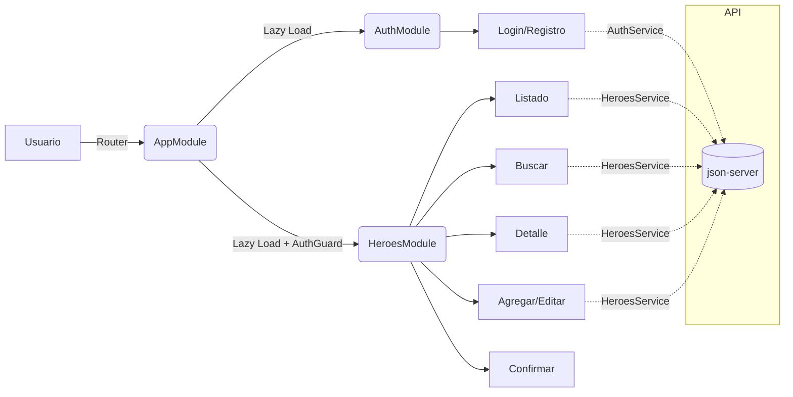

# HéroesApp — Presentación del Proyecto

## Funcionalidades principales
- Autenticación de usuario (login simulado) y protección de rutas.
- Listado de héroes, detalle, búsqueda con autocompletado.
- Alta/edición de héroes con validación básica y confirmación de borrado.
- Página de error para rutas no existentes.

## Arquitectura general
- Angular 15 + TypeScript.
- Módulos por dominio (auth, heroes), lazy loading y guards.
- Angular Material + FlexLayout para UI y layout responsivo.
- Servicios HTTP (HttpClient) y RxJS para comunicación con API.
- json-server como backend simulado en desarrollo.
- Environments para separar configuración de dev/prod.



## Estructura de carpetas (resumen)
```
src/
  app/
    app.module.ts
    app-routing.module.ts
    auth/
      auth.module.ts
      auth-routing.module.ts
      pages/login/ | pages/registro/
      services/auth.service.ts
      guards/auth.guard.ts
      interfaces/auth.interface.ts
    heroes/
      heroes.module.ts
      heroes-routing.module.ts
      pages/{listado,buscar,heroe,agregar,home}/
      services/heroes.service.ts
      interfaces/heroes.interface.ts
      components/{heroe-tarjeta,confirmar}/
      pipes/imagen.pipe.ts
    material/material.module.ts
    shared/error-page/
  environments/
    environment.ts
    environment.prod.ts
```

## Estructura de módulos
- AppModule (`src/app/app.module.ts`)
  - Declara `AppComponent` y `ErrorPageComponent`.
  - Importa `BrowserModule`, `BrowserAnimationsModule`, `HttpClientModule` y `AppRoutingModule`.
- AuthModule (`src/app/auth/auth.module.ts`)
  - Declara `LoginComponent`, `RegistroComponent`.
  - Importa `AuthRoutingModule`, `MaterialModule`.
- HeroesModule (`src/app/heroes/heroes.module.ts`)
  - Declara `ListadoComponent`, `BuscarComponent`, `HeroeComponent`, `AgregarComponent`, `HomeComponent`, `HeroeTarjetaComponent`, `ConfirmarComponent`, `ImagenPipe`.
  - Importa `CommonModule`, `FormsModule`, `FlexLayoutModule`, `MaterialModule`, `HeroesRoutingModule`.
- MaterialModule (`src/app/material/material.module.ts`)
  - Reexporta módulos de Angular Material y `FlexLayoutModule` usados en la app.

## Rutas
- AppRoutingModule (`src/app/app-routing.module.ts`)
  - `/auth` → carga `AuthModule` (lazy).
  - `/heroes` → carga `HeroesModule` (lazy) con `canLoad` y `canActivate` (`AuthGuard`).
  - `/404` → `ErrorPageComponent`; `**` → redirige a `404`.
- HeroesRoutingModule (`src/app/heroes/heroes-routing.module.ts`)
  - `''` → `HomeComponent` (con rutas hijas):
    - `listado` → `ListadoComponent`
    - `agregar` → `AgregarComponent`
    - `editar/:id` → `AgregarComponent`
    - `buscar` → `BuscarComponent`
    - `:id` → `HeroeComponent`
    - `**` → redirige a `listado`
- AuthRoutingModule (`src/app/auth/auth-routing.module.ts`)
  - `login` → `LoginComponent`
  - `registro` → `RegistroComponent`
  - `**` → redirige a `login`

## Componentes y piezas clave
- `LoginComponent`: Simula login; al autenticarse navega a `/heroes`.
- `AuthService`: Gestiona estado de usuario, `login`, `logout` y `verificaAutenticacion()` usando `localStorage` y llamada a `/usuarios/1`.
- `AuthGuard`: Protege `/heroes` con `canLoad` y `canActivate` redirigiendo a `/auth/login` si no hay sesión válida.
- `ListadoComponent`: Carga y muestra todos los héroes (GET `/heroes`).
- `BuscarComponent`: Autocompletado; sugiere héroes via `q` y `_limit` (GET `/heroes?q=termino&_limit=6`).
- `HeroeComponent`: Detalle de héroe por `id` (GET `/heroes/:id`).
- `AgregarComponent`: Crear/Actualizar héroe; usa `MatSnackBar` y `MatDialog` (`ConfirmarComponent`) para borrar.
- `HeroeTarjetaComponent`: Tarjeta visual para un héroe (UI con Material/Flex).
- `ImagenPipe`: Resuelve imagen del héroe (fallback si no hay `alt_img`).
- `HeroesService`: CRUD hacia `environment.baseUrl`.

## Environments
- `environment.ts` (dev):
  ```ts
  export const environment = { production: false, baseUrl: 'http://localhost:3000' };
  ```
- `environment.prod.ts` (prod):
  ```ts
  export const environment = { production: true, baseUrl: 'https://api.myapp.example' };
  ```
- `angular.json` configura `fileReplacements` para usar `environment.prod.ts` en producción.

## Tecnologías y versiones
- Angular 15, Angular CLI 15.2.x
- TypeScript, RxJS
- Angular Material, FlexLayout
- HttpClient
- json-server (API mock)

## Cómo ejecutar
1) Instalar dependencias:
```powershell
npm install
```
2) (Opcional) Levantar API mock con json-server:
- Crear un `db.json` con colecciones `heroes` y `usuarios` (puedo proveer uno de ejemplo).
- Arrancar:
```powershell
json-server --watch db.json --port 3000
```
3) Ejecutar la app en desarrollo:
```powershell
npm start
# o
ng serve
```
4) Compilar producción (usa `environment.prod.ts`):
```powershell
ng build --configuration production
```

## Decisiones de diseño
- Lazy loading para mejorar rendimiento inicial.
- `AuthGuard` con `canLoad`/`canActivate` para evitar descarga de módulos protegidos.
- `MaterialModule` para centralizar y controlar los imports de UI.
- `environment.baseUrl` para no acoplar endpoints al código.

## Posibles mejoras
- Añadir módulos de Angular Material usados explícitamente: `MatDialogModule`, `MatSnackBarModule`, `MatAutocompleteModule`, `MatFormFieldModule`, `MatInputModule`, etc., a `MaterialModule`.
- Validaciones de formularios con `ReactiveFormsModule`.
- Manejo de errores HTTP global e interceptores.
- Test unitarios para servicios, guards y pipes.
- Reemplazar FlexLayout por utilidades CSS modernas (Flexbox/Grid) a largo plazo.

---

> ¿Quieres que agregue un `db.json` con datos de ejemplo y un script npm para iniciar `json-server`? También puedo completar el `MaterialModule` con todos los módulos que ya estás usando en los componentes.
